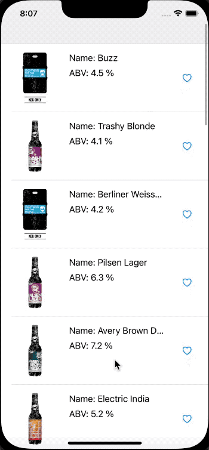

## Name
Beers list.

## Description
Test project written in Swift, part of a code challenge.

First commit references what was done under the challenge time.

## Features:
  - MVVM design pattern;
  - Reactive programming with Combine;
  - Programmatic views;
  - Paginated API consume with [Punk API](https://api.punkapi.com/v2/);

